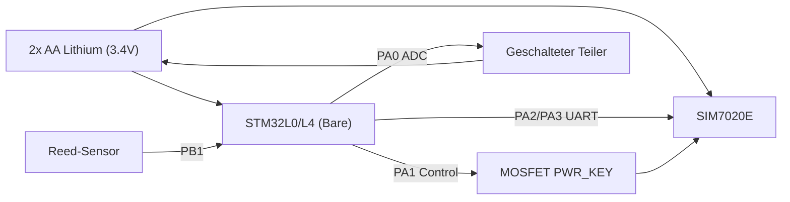

# PCB Design Guide: CatchSensor (Max Efficiency)

Um die maximale Effizienz aus deinen 2x AA Lithium-Batterien herauszuholen, verzichten wir auf Nucleo-Boards und bauen ein minimalistisches PCB mit den nackten ICs.

## 1. Controller: STM32L0 / STM32L4 (Bare Chip)
Wähle ein Gehäuse, das du gut löten kannst (z.B. LQFP32 oder LQFP48).
- **Entkopplung**: Jeder VDD/VDDA Pin benötigt einen 100nF Keramikkondensator so nah wie möglich am Chip. Ein zusätzlicher 4.7µF oder 10µF Tantalkondensator für die gesamte Schiene ist ratsam.
- **Reset**: Ein 10k Pull-up an NRST und ein 100nF gegen GND für Stabilität.
- **Takt**: Für maximale Ersparnis verzichte auf einen externen Quarz (HSE) und nutze den internen MSI oder HSI (kalibriert).

## 2. NB-IoT: SIM7020E Integration
Verwende das Modul direkt im SMT-Package.
- **Power Path**: Da du 2x AA Lithium nutzt (~3.4V), verbinde VBAT direkt mit der Batterie.
- **Pufferung**: Platziere einen **1000µF Low-ESR Elektrolytkondensator** und einen 100µF Keramikkondensator direkt an den VBAT-Pins des SIM7020. Das verhindert Brown-outs bei GSM/LTE-Bursts.
- **PWR_KEY Control**: Nutze einen N-Kanal MOSFET (z.B. 2N7002), um den PWR_KEY des SIM7020 gegen GND zu ziehen, gesteuert vom STM32.

## 3. Strommanagement (The Secret Sauce)
- **Kein LDO**: Da Lithium-Batterien (2x 1.7V) bis zum Ende sicher im Bereich von 3.6V bis 2.0V liegen, betreiben wir alles direkt. Das spart den "Quiescent Current" (Ruhestrom) eines Spannungsreglers.
- **Sensoren**: Der Reed-Sesor nutzt den internen Pull-up des STM32, der nur aktiv ist, wenn der STM32 wach ist oder im Low-Power-Modus mit "Pull-up-Retention".

## 4. Batterie-Spannungsteiler (Ultra-Low-Power)
Ein statischer 100k/100k Teiler verbraucht permanent Strom (ca. 17µA). Bei 2x AA AA Lithium ist das zu viel.
- **Geschalteter Teiler**: Setze den "unteren" Widerstand des Teilers an den Drain eines MOSFETs. Nur wenn der STM32 messen will, schaltet er den MOSFET ein. Stromverbrauch im Schlaf: 0µA.

## 5. Layout-Tipps
- **Ground Plane**: Nutze eine durchgehende Massefläche auf der Unterseite.
- **Antenne**: Halte den Pfad vom SIM7020 zum Antennenanschluss (U.FL oder SMA) so kurz wie möglich (50 Ohm Impedanz-kontrolliert). Keine Massefläche direkt unter der Antenne/dem RF-Pad.
- **Programming**: Sieh einen 4-poligen Header (3.3V, GND, SWDIO, SWCLK) für den ST-Link vor.

---
## Schaltplan-Skizze (Blöcke)

