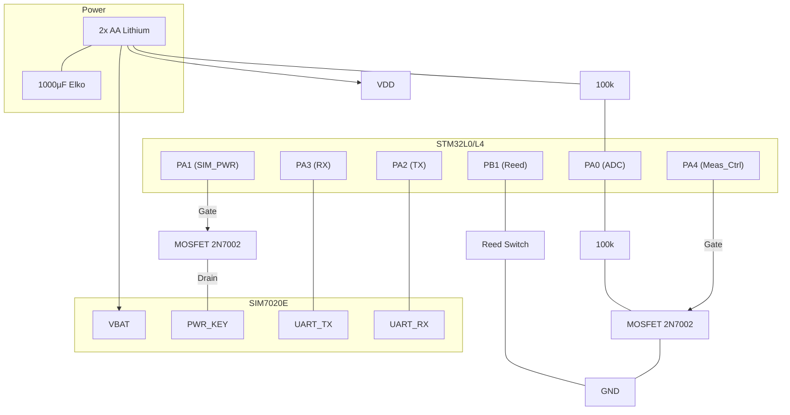

# Schematic Guide: CatchSensor (Custom PCB)

Dieses Schema optimiert den CatchSensor für den Betrieb an 2x AA Lithium-Zellen (~3.4V).

## 1. STM32 Minimal-Beschaltung
| Pin | Verbindung | Zweck |
|-----|------------|-------|
| **VDD / VDDA** | Batterie (+) | Direkte Versorgung (3.4V). |
| **VSS / VSSA** | Batterie (-) | Masse (GND). |
| **NRST** | 10k Pull-up zu VDD, 100nF zu GND | Stabiler Reset. |
| **SWDIO** | Header Pin 2 | Programming (Data). |
| **SWCLK** | Header Pin 3 | Programming (Clock). |

## 2. SIM7020E NB-IoT Sektion
- **VBAT**: Direkt an Batterie (+). Mind. 1000µF Low-ESR Elko parallel schalten!
- **GND**: Direkt an Masse.
- **UART RX (SIM)**: An PA2 (STM32 TX).
- **UART TX (SIM)**: An PA3 (STM32 RX).
- **PWR_KEY**: Über einen 2N7002 MOSFET gesteuert von PA1.
  - *Schaltung*: PA1 -> Gate, Source -> GND, Drain -> PWR_KEY.

## 3. Sensorik & Batterie-Messung (Ultra-Low-Power)
### Reed-Sensor
- **Pin**: PB1 (STM32) -> Reed-Kontakt -> GND.
- Der STM32 nutzt den internen Pull-up.

### Geschalteter Spannungs-Teiler (Batterie)
Verhindert Dauerstrom über die Widerstände.
- **VCC** -> 100k Widerstand -> ADC (PA0).
- **ADC (PA0)** -> 100k Widerstand -> Drain (2N7002 MOSFET).
- **Gate (2N7002)** -> Steuerung durch PA4 (STM32).
- **Source (2N7002)** -> GND.
- *Funktion*: Schalte PA4 nur zur Messung auf HIGH.

## 4. Schaltplan-Diagramm

## 5. Design-Regeln
1. **Breite Leitungen**: Die Leiterbahn von der Batterie zum SIM7020E (`VBAT`) muss breit sein (min. 0.5mm - 1.0mm), um die Stromspitzen abzufangen.
2. **Kondensatoren**: Platziere die 100nF Kondensatoren so nah wie möglich an die VDD-Pins des STM32.
3. **Massefläche**: Nutze eine durchgehende Massefläche auf der Unterseite (Bottom Layer), um Störungen zu minimieren.
